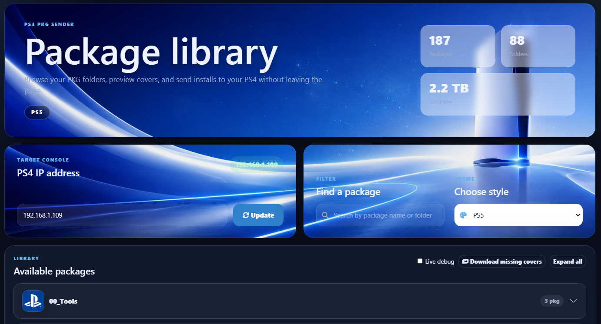

# PS4 PKG Sender

A simple web-based PS4 PKG sender for installing `.pkg` files on a PlayStation 4 over the network.

This project is a fork of [`justanormaldev/ps4-pkg-sender`](https://github.com/justanormaldev/ps4-pkg-sender), with extra UI improvements, folder thumbnails, cover downloading, Docker support, and better handling for large local PKG libraries.

## Features

- Web interface for browsing and sending PS4 `.pkg` files
- Folder-based library view
- Folder thumbnails from `src/public/thumbnail/`
- PKG/game cover images from `src/public/images/`
- Strict separation between thumbnails and package cover images
- Download missing covers button
- Live debug toggle for cover downloads
- Timeout handling so one slow cover source does not stop the whole scan
- Docker and Docker Compose support

## Cover search order

The **Download missing covers** button searches in this order. The **Live debug** toggle shows progress while the scan is running:

1. GitHub cover map
2. PlayStation Store by CUSA
3. SerialStation by CUSA
4. ORBISPatches by CUSA
5. Content ID lookup
6. SerialStation title search
7. PlayStation Store title search

The search engine checks for these title ID formats:
CUSAxxxxx
SLUSxxxxx
SCUSxxxxx
SCESxxxxx
SLESxxxxx
SLPSxxxxx
SLPMxxxxx
NPUJxxxxx
NPUIxxxxx
NPEFxxxxx
NPUGxxxxx
NPEGxxxxx
NPUBxxxxx
NPEBxxxxx
NPHGxxxxx
ULUSxxxxx
ULESxxxxx
UCUSxxxxx
UCESxxxxx

If nothing is found, the app keeps using the fallback `folder.png` image for missing cover images.

If one source is slow, times out, or fails, the app marks that item as skipped/failed and moves to the next missing image instead of stopping the whole scan.

Package images are saved to:

```text
src/public/images/
```

Folder thumbnails are saved to:

```text
src/public/thumbnail/
```

## Screenshots



## Folder structure

Example project structure:

```text
ps4pkgsender/
├── Dockerfile
├── package.json
├── src/
│   ├── app.js
│   ├── views/
│   │   └── index.html
│   └── public/
│       ├── images/
│       │   └── Alan_Wake_Remastered_CUSA24653.jpg
│       └── thumbnail/
│           └── Alan_Wake_Remastered_CUSA24653.jpg
└── README.md
```

## PKG library layout

You can place PKG files directly in the configured package folder or inside subfolders.

Recommended layout:

```text
/pkgs/
├── Alan_Wake_Remastered_CUSA24653/
│   ├── Alan_Wake_Remastered_CUSA24653.pkg
│   └── Alan_Wake_Remastered_UPD_v1_03_CUSA24653.pkg
├── Assassins_Creed_Valhalla_CUSA18534/
    ├── Assassins_Creed_Valhalla_CUSA18534.pkg
    └── Assassins_Creed_Valhalla_CUSA18534_V101.pkg

```

The folder name becomes the accordion/header name.

The package rows show the original `.pkg` filename, so it is easy to know exactly which file you are sending.

## Download missing covers

Click **Download missing covers** in the web interface.

The downloader only searches for missing images and missing thumbnails.

It saves package images to:

```text
src/public/images/
```

It saves folder thumbnails to:

```text
src/public/thumbnail/
```

The result panel stays visible after the download finishes, so you can see what was downloaded, skipped, or failed.

Enable **Live debug** before clicking **Download missing covers** to see each item as it is processed. If an external source hangs or takes too long, the app uses the timeout settings and continues to the next missing image.

Example result:

```text
Missing files checked 77. Downloaded 22. Skipped 0. Failed 55.
DOWNLOADED: image - Far_Cry 5_CUSA05848.pkg (CUSA05848)
FAILED: thumbnail - Castlevania_SLUS00067.pkg
```

## Environment variables

| Variable | Description | Example |
|---|---|---|
| `LOCALIP` | IP or hostname that the PS4 can reach to download PKGs from this server | `192.168.1.202` |
| `PS4IP` | PS4 package installer IP address | `192.168.1.50` |
| `PORT` | Web server port inside the container | `7777` |
| `PKG_DIR` | Path to your package library inside the container | `/pkgs` |
| `COVER_MAP_URL` | Optional JSON cover map URL | `https://raw.githubusercontent.com/hmn/ps4-imagemap/master/games.json` |
| `COVER_STORE_REGIONS` | PlayStation Store regions to try | `DK/da,GB/en,US/en,DE/de,SE/sv,NO/no` |
| `COVER_SEARCH_REGIONS` | Regions used for title search | `DK/da,GB/en,US/en,DE/de,SE/sv,NO/no` |
| `COVER_ENABLE_ORBISPATCHES` | Enable ORBISPatches as final fallback | `true` |
| `COVER_FETCH_TIMEOUT_MS` | Timeout for each external cover-source request in milliseconds | `7000` |
| `COVER_ITEM_TIMEOUT_MS` | Maximum time spent on one missing image/thumbnail before moving to the next item | `45000` |

Example `.env`:

```env
LOCALIP=192.168.1.202
PS4IP=192.168.1.50
PORT=7777
PKG_DIR=/pkgs
COVER_STORE_REGIONS=DK/da,GB/en,US/en,DE/de,SE/sv,NO/no
COVER_SEARCH_REGIONS=DK/da,GB/en,US/en,DE/de,SE/sv,NO/no
COVER_ENABLE_ORBISPATCHES=true
COVER_FETCH_TIMEOUT_MS=7000
COVER_ITEM_TIMEOUT_MS=45000
```

## Docker Compose example

Example `docker-compose.yml`:

```yaml
services:
  pkgsender:
    container_name: pkgsender
    build: .
    restart: unless-stopped
    ports:
      - "7777:7777"
    environment:
      LOCALIP: "192.168.1.202"
      PS4IP: "192.168.1.50"
      PORT: "7777"
      PKG_DIR: "/pkgs"
      COVER_ENABLE_ORBISPATCHES: "true"
      COVER_STORE_REGIONS: "DK/da,GB/en,US/en,DE/de,SE/sv,NO/no"
      COVER_SEARCH_REGIONS: "DK/da,GB/en,US/en,DE/de,SE/sv,NO/no"
      COVER_FETCH_TIMEOUT_MS: "7000"
      COVER_ITEM_TIMEOUT_MS: "45000"
    volumes:
      - /path/to/your/pkgs:/pkgs
      - ./src/public/images:/pkg_sender/src/public/images
      - ./src/public/thumbnail:/pkg_sender/src/public/thumbnail
```

Start it:

```bash
docker compose up -d --build
```

Or with the older Compose command:

```bash
docker-compose up -d --build
```

View logs:

```bash
docker logs -f pkgsender
```

## PS4 setup

On the PS4:

1. Enable the package installer.
2. Make sure the PS4 and the server can reach each other over the network.
3. Open the web interface.
4. Set or confirm the PS4 IP.
5. Click **Install** next to the package you want to send.

The PS4 must be able to download from the server using `LOCALIP`.

Example:

```text
http://192.168.1.202:7777/files/Game.pkg
```

If the PS4 cannot reach the server IP, the install request may be accepted but the download will fail on the PS4.


## Troubleshooting

### Missing cover downloader runs but some covers fail

Some title IDs do not exist in every region, and some homebrew packages do not have official covers.

Try adding more regions:

```env
COVER_STORE_REGIONS=US/en,GB/en,DK/da,DE/de,FR/fr,ES/es,IT/it,SE/sv,NO/no
COVER_SEARCH_REGIONS=US/en,GB/en,DK/da,DE/de,FR/fr,ES/es,IT/it,SE/sv,NO/no
```


### Live debug seems stuck on one item

A cover source can sometimes respond very slowly or hang. Use these timeout variables to make the app continue to the next missing image instead of waiting too long:

```env
COVER_FETCH_TIMEOUT_MS=7000
COVER_ITEM_TIMEOUT_MS=45000
```

For faster testing, you can lower them:

```env
COVER_FETCH_TIMEOUT_MS=4000
COVER_ITEM_TIMEOUT_MS=20000
```

`COVER_FETCH_TIMEOUT_MS` controls each external HTTP request.

`COVER_ITEM_TIMEOUT_MS` controls the total maximum time spent on one missing image or thumbnail before the app moves to the next item.

### SerialStation image failed with `Cover URL is not http/https`

Update to a version that converts relative SerialStation image URLs to full `https://serialstation.com/...` URLs.

